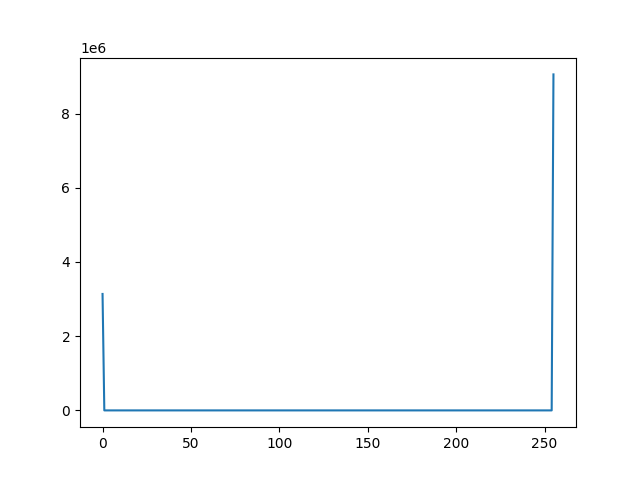

# Homework 1 CS 381/780 Image Processing
## Omar Mirza, Adam Binder, Yougeeta Singh

### QUESTION 1

* For the overexposed image, most pixel intensity values are high (near 255) and for the overexposed images, and for the underexposed image, most intensity values are low (near 0)

### QUESTION 2

* The number of pixels that belong to the object of interest was obtained by getting the total pixel count of the image and subtracting it by the total number of non-black pixels, which came out to 720 pixels.
* The histogram primarily consists of black and/or white values, with some other color values in between. The first image of the uniform background without an object mainly consists of white, whereas the second image with the object contains mainly black.

### QUESTION 3

### QUESTION 4

#### INSTRUCTIONS

* to run place input images in input folder
* make sure your cwd is imgprocessing/hw1/
* run scripts
