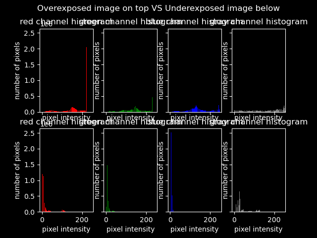
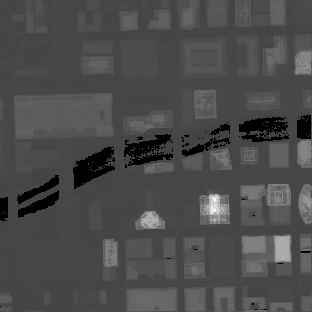

# Homework 1 CS 381/780 Image Processing
## Omar Mirza, Adam Binder, PSINGH

### QUESTION 1

⋅⋅* For the overexposed image, most pixel intensity values are high (near 255) and for the overexposed images, and for the underexposed image, most intensity values are low (near 0)

### QUESTION 2

⋅⋅* The object of interest is ??? pixels
⋅⋅* briefly describe the results???

### QUESTION 3

### QUESTION 4

