# Homework 2 CS 381/780 Image Processing
## Omar Mirza, Adam Binder, Yougeeta Singh

### ORIGINAL IMAGES

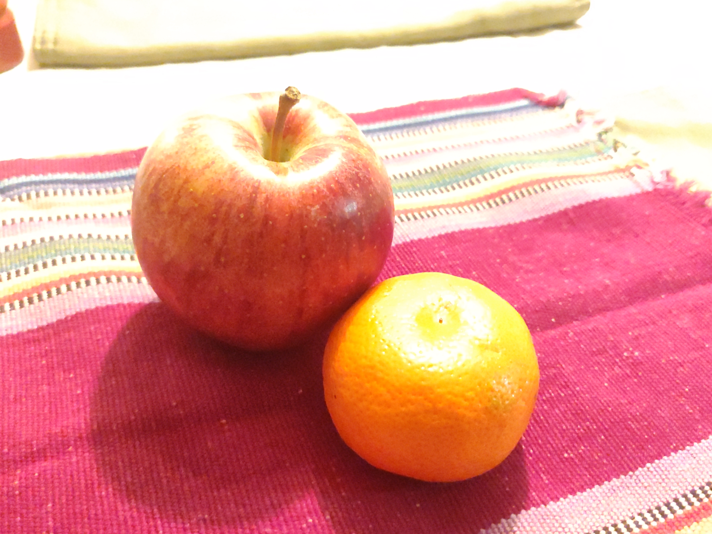
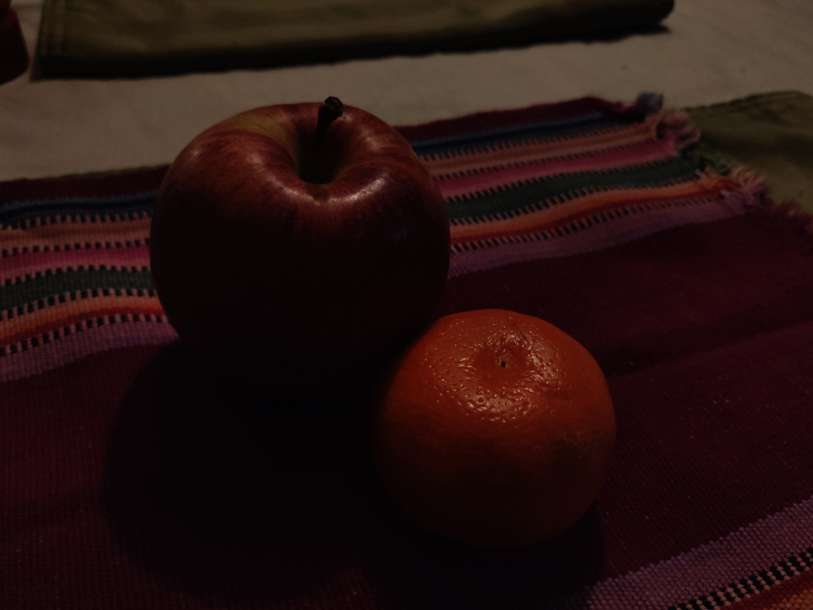

### QUESTION 1

Original (left) vs Overexposed image corrected to 1.7 gamma (right)

Original (left) vs Underexposed image corrected to 0.5 gamma (right)

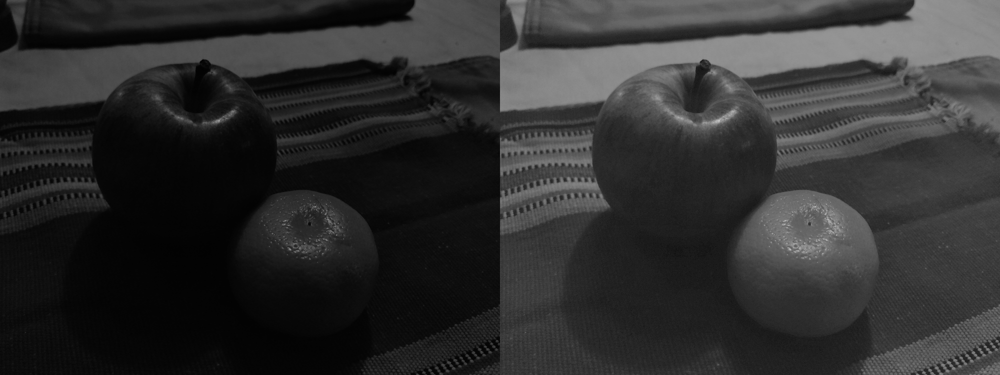

histograms

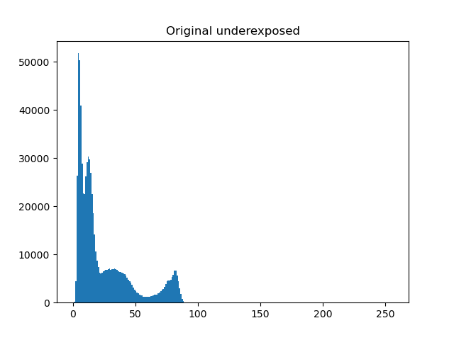
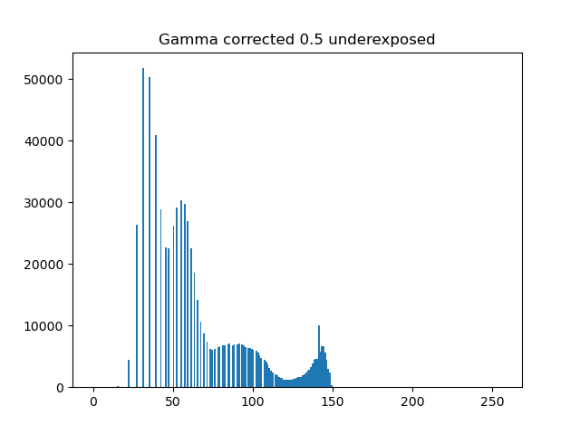
 
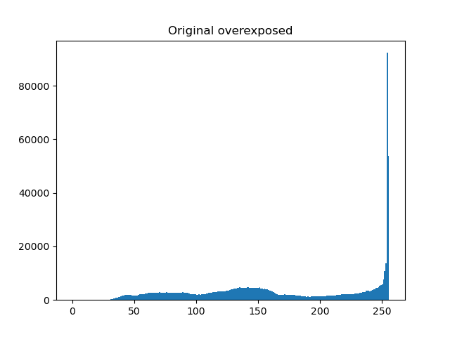
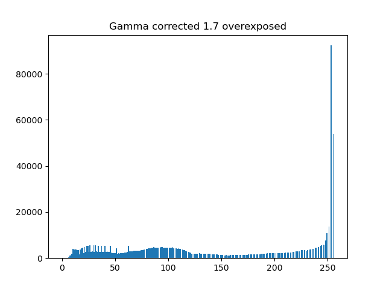

### QUESTION 2

Original (left) vs Overexposed image equalized (right)

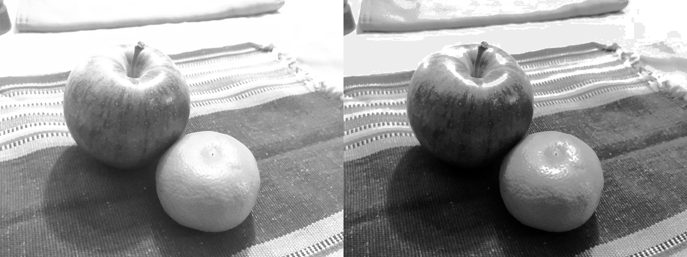

Original (left) vs Underexposed image equalized (right)

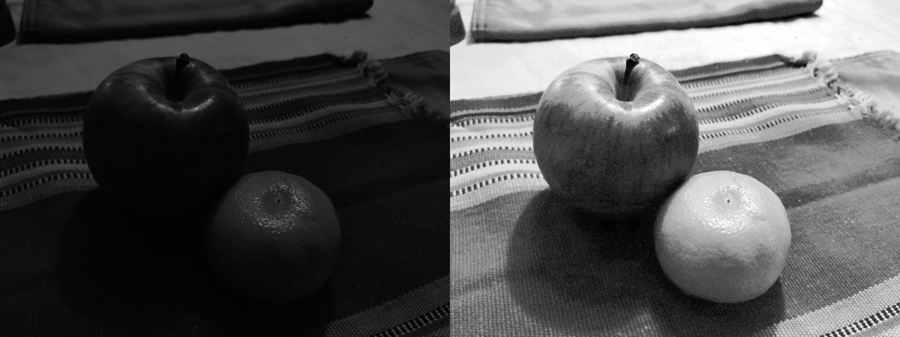

histograms

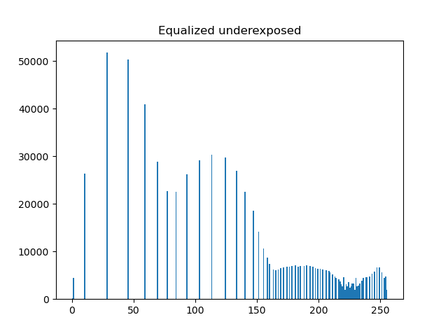
 

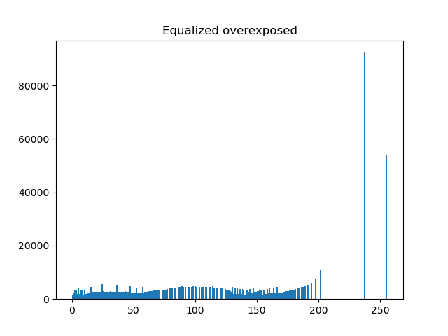

### QUESTION 3

Underexposed Image Equalized

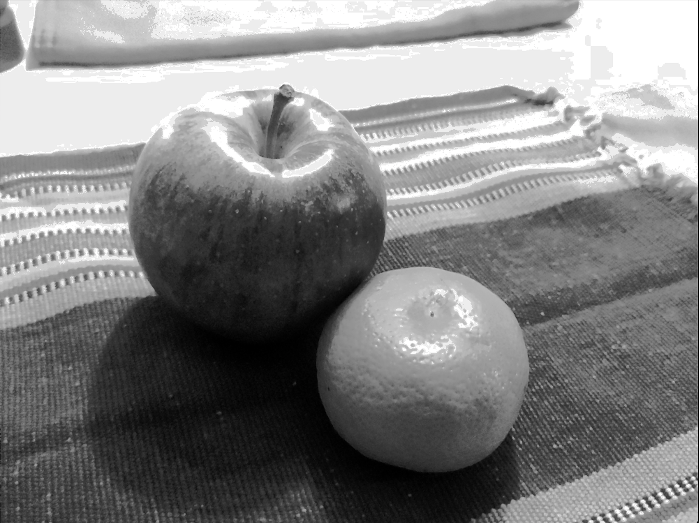

Overexposed Image Equalized

### QUESTION 4

Original Image Input and Histogram
 
 
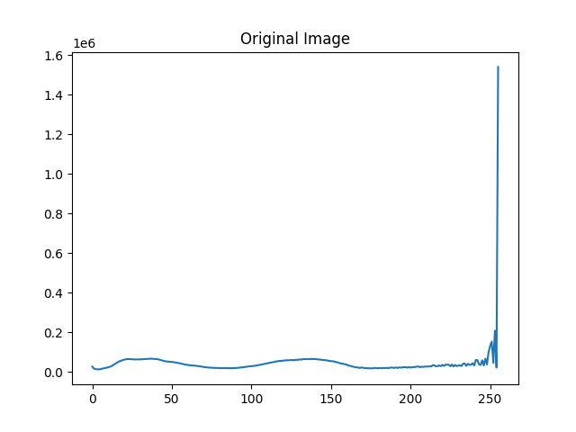

Reference Image Input and Histogram
 
 
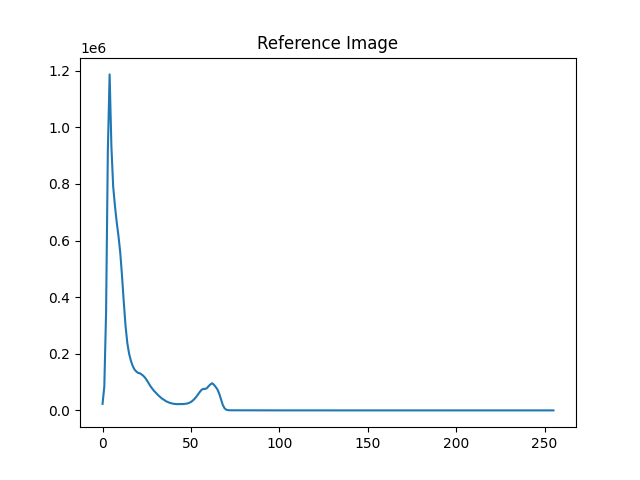

New Image Output and Histogram
 
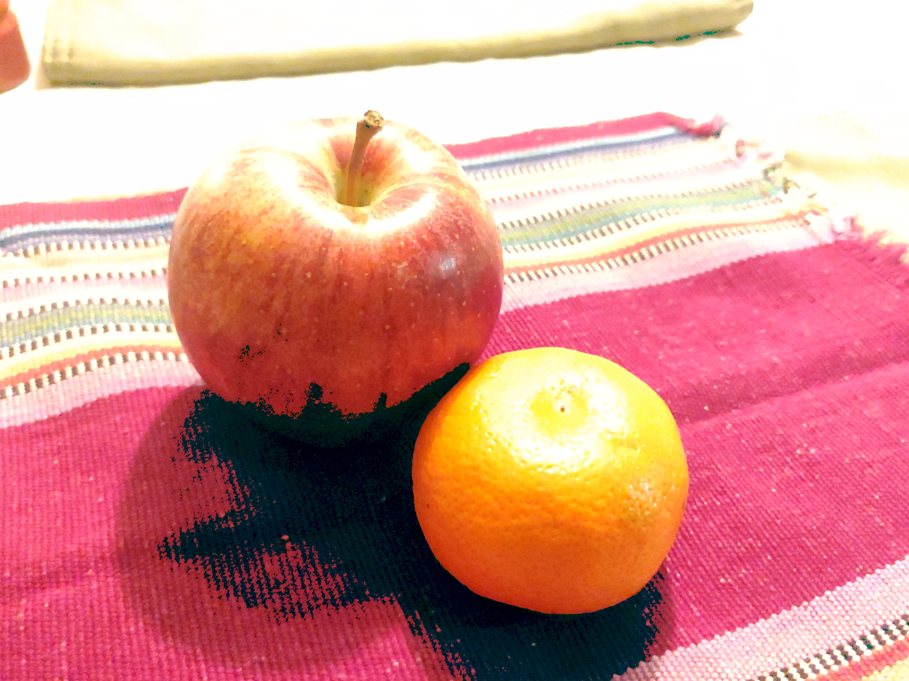 
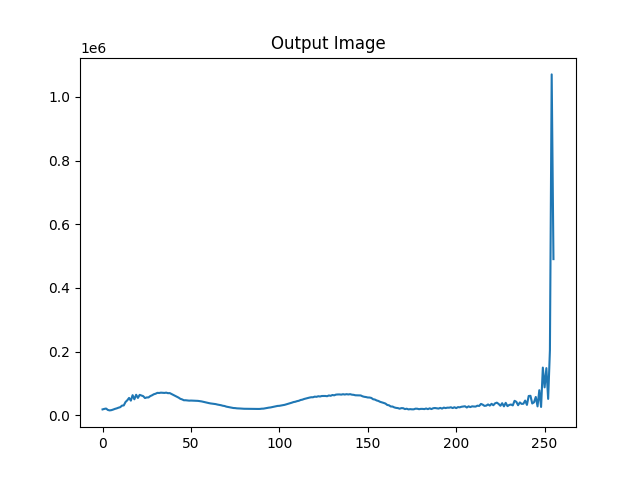

### QUESTION 5

Gaussian Kernel
 

Box Kernel
 

Robert Kernel
 
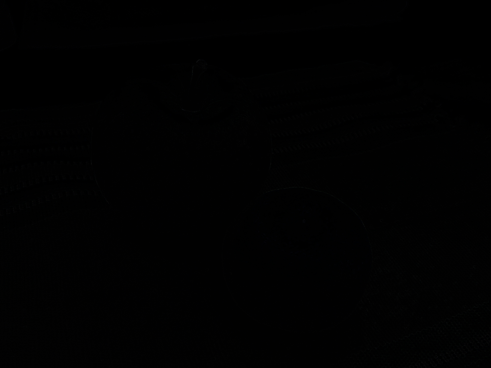

Sobel Kernel
 

Second-order Derivative
 

Unsharp and Highboost Filtering
 

