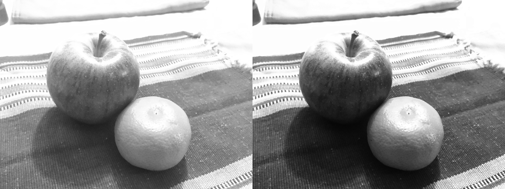

# Homework 2 CS 381/780 Image Processing
## Omar Mirza, Adam Binder, Yougeeta Singh

### ORIGINAL IMAGES

### QUESTION 1

Original (left) vs Overexposed image corrected to 1.7 gamma (right)

Original (left) vs Underexposed image corrected to 0.5 gamma (right)

histograms

 

### QUESTION 2

Original (left) vs Overexposed image equalized (right)

Original (left) vs Underexposed image equalized (right)

histograms

 

### QUESTION 3

Underexposed Image Equalized

Overexposed Image Equalized

### QUESTION 4

Original Image Input and Histogram
 
 

Reference Image Input and Histogram
 
 

New Image Output and Histogram
 
 

### QUESTION 5

Gaussian Kernel
 

Box Kernel
 

Robert Kernel
 

Sobel Kernel
 

Second-order Derivative
 

Unsharp and Highboost Filtering
 

